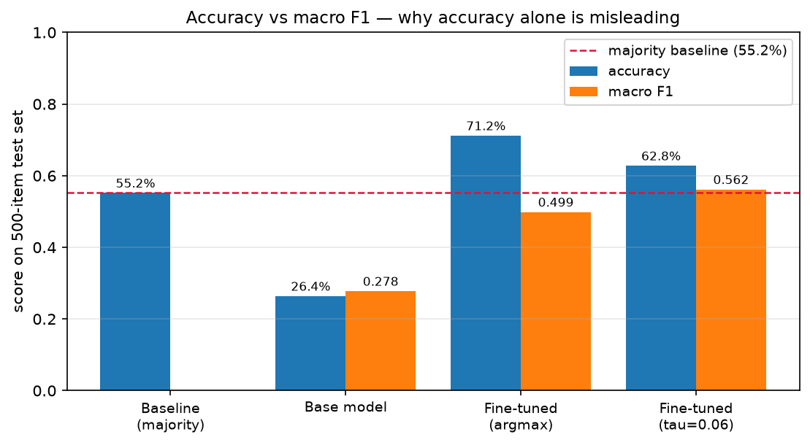
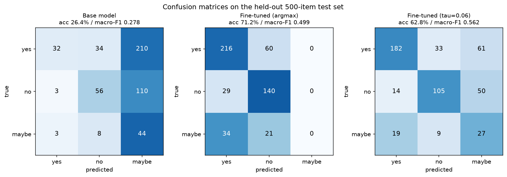
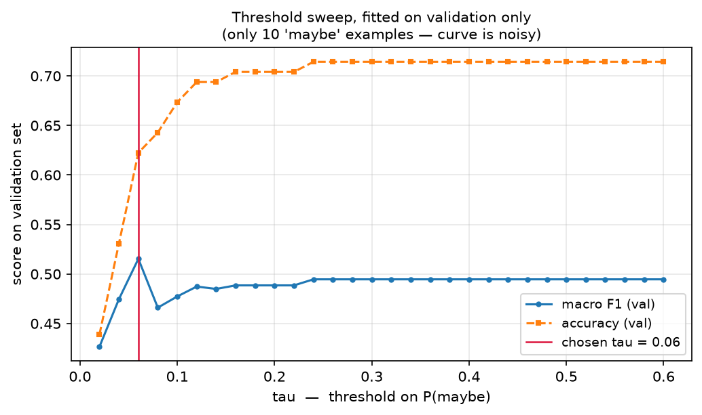

# PubMedQA QLoRA Fine-Tuning Pipeline

Fine-tuning **Qwen2.5-3B-Instruct** on [PubMedQA](https://huggingface.co/datasets/qiaojin/PubMedQA) with QLoRA, on a single 6 GB consumer laptop GPU.

The task: given a biomedical research question and the abstract that addresses it, answer **yes**, **no**, or **maybe**. Because the label is categorical, the model can be scored with exact-match accuracy and per-class F1 — no LLM-as-judge, no subjective grading.

The project covers the full loop: data preparation → training → evaluation against a quarantined test set → a calibration experiment → a CLI inference interface.

---

## Results




Evaluated on the **official 500-item PubMedQA expert test split**, never seen during training.

| Configuration | Accuracy | Macro F1 | `maybe` F1 |
|---|---|---|---|
| Majority-class baseline | 55.2% | — | — |
| Base model, no adapter | 26.4% | 0.2778 | 0.210 |
| **QLoRA fine-tuned (argmax)** | **71.2%** | 0.4988 | 0.000 |
| QLoRA fine-tuned (calibrated, τ=0.06) | 62.8% | **0.5619** | 0.280 |

**Headline: 71.2% accuracy vs. a 55.2% majority-class baseline — +16 points.**

Two numbers in that table need context, and both are discussed below: the base model's 26.4% is an artifact of the scoring method and should be read as a floor rather than a fair zero-shot estimate; and the calibrated row is a **tradeoff**, not a strict improvement.

### Per-class breakdown (fine-tuned, argmax)

| Class | Precision | Recall | F1 | Support |
|---|---|---|---|---|
| yes | 0.774 | 0.783 | 0.778 | 276 |
| no | 0.633 | 0.828 | 0.718 | 169 |
| maybe | 0.000 | 0.000 | 0.000 | 55 |

```
Confusion matrix (rows = true, cols = predicted)
              yes    no  maybe
  yes         216    60      0
  no           29   140      0
  maybe        34    21      0
```

The `maybe` column is entirely zero. That failure is the most interesting part of this project and is analysed in [Findings](#findings).

---

## Quickstart

Requires Python 3.11 or 3.12 (**not 3.14** — the CUDA/quantization stack does not yet ship wheels for it) and an NVIDIA GPU with ≥6 GB VRAM.

```bash
git clone <this-repo>
cd pubmedqa-lora

python -m venv .venv
source .venv/bin/activate          # Windows: .venv\Scripts\Activate.ps1

pip install torch --index-url https://download.pytorch.org/whl/cu124
pip install -r requirements.txt

python -c "import torch; print(torch.cuda.is_available())"   # must print True
```

Then run the pipeline:

```bash
python -m src.data_prep                  # build train/val/test JSONL
python -m src.train                      # QLoRA fine-tune (~42 min on RTX 4050)
python -m src.evaluate --model base      # score the base model
python -m src.evaluate --model tuned     # score the fine-tuned model
python -m src.calibrate                  # threshold calibration experiment
python -m src.infer --demo 8             # sample predictions with confidences
python -m src.infer --interactive        # paste your own question + abstract
```

---

## Pipeline

```
qiaojin/PubMedQA
       │
       ▼
  data_prep.py ──►  data/train.jsonl  (4,342)
                    data/val.jsonl    (98)
                    data/test.jsonl   (500, quarantined)
       │
       ▼
    train.py   ──►  outputs/adapter/          LoRA weights
       │
       ▼
  evaluate.py  ──►  outputs/eval_results.json base vs tuned
       │
       ▼
 calibrate.py  ──►  outputs/calibration.json  threshold sweep
       │
       ▼
    infer.py                                  CLI demo / interactive
```

Every stage reads its settings from `src/config.py`, so a run is reproducible from one file.

---

## Data

| Split | Rows | Source | Composition |
|---|---|---|---|
| train | 4,342 | `pqa_artificial` + leftover expert rows | 2,000 yes + 2,000 no (balanced sample) + ~400 expert rows; 58 dropped by length filter |
| val | 98 | `pqa_labeled` | stratified; 10 `maybe` |
| test | 500 | `pqa_labeled` | 276 yes / 169 no / 55 maybe — the official test split |

`pqa_labeled` contains 1,000 expert-annotated rows (552 yes / 338 no / 110 maybe). `pqa_artificial` contains 211,269 machine-labeled rows and is **92.8% yes with zero `maybe`**.

### Design decisions

**The test set is quarantined.** All 500 rows come from the expert-annotated split, are never trained on, and are exempt from the length filter that trims training rows. Because it matches the official split, the accuracy figure is comparable to published work rather than only to itself. `data_prep.py` asserts that no test `pubid` appears in training — the check passes trivially, but having it in code is the difference between believing there is no leakage and knowing it.

**Class-balanced sampling.** Drawing naively from `pqa_artificial` yields ~93% `yes`, which trains a model that answers "yes" to everything and still scores 55.2% — indistinguishable from guessing. Sampling an equal count per available class, plus mixing in the leftover expert rows, is the only reason `maybe` appears in training at all.

**Loss is masked on the prompt.** Training data is converted from chat format to prompt/completion format so the trainer computes loss only on the answer token. Without this, ~99% of the gradient signal goes toward reproducing abstracts the model will never be asked to generate.

---

## Training

| Setting | Value |
|---|---|
| Base model | `Qwen/Qwen2.5-3B-Instruct` |
| Quantization | 4-bit NF4, double quant, bf16 compute |
| LoRA | r=16, α=32, dropout=0.05 |
| Target modules | q, k, v, o, gate, up, down projections |
| Sequence length | 512 |
| Effective batch | 16 (micro-batch 2 × grad accum 8) |
| Optimizer | `paged_adamw_8bit`, lr 2e-4, cosine schedule |
| Epochs | 1 (240 steps) |
| Wall time | 41m 40s on an RTX 4050 Laptop (6 GB) |
| Peak VRAM | 4.34 GB |
| Final train loss | 0.1056 |
| Final eval loss | 0.259 |

LoRA targets all attention **and** MLP projections. Attention-only (`q_proj`/`v_proj`) is the common tutorial default and underfits classification-style tasks.

---

## Evaluation method

Both models are scored by **constrained comparison**, not free generation: one forward pass per item, reading the logits at the final position and comparing the token scores for `yes`, `no`, and `maybe` (with casing and leading-space variants folded in). The highest wins.

Free generation plus string parsing would be unfair. The base model was never instructed to answer in one word — left alone it writes a paragraph, which a parser scores as a miss. The measured gain would then largely reflect the fine-tuned model having learned the *output format*, not having become better at the *task*. Constrained scoring makes both models answer on identical terms, so the delta is attributable to the adapter. It is also a single forward pass instead of autoregressive decoding, so it is much faster.

`infer.py` uses the same scoring method, so the demo can never contradict the published metrics.

### Caveat on the base-model number

The base model scores 26.4%, below the majority-class baseline, and predicted `maybe` for 364 of 500 items. Published zero-shot LLM results on PubMedQA generally sit higher. The likely cause is that at the first generation position the base model has no inclination to emit a bare label token at all, so the comparison is being made among three tokens it assigns low probability to, where the ordering is noisy.

**Treat 26.4% as a floor, not a fair zero-shot estimate.** The meaningful comparison in this project is against the **55.2% majority-class baseline**, not against the base model. Claiming a "+44.8 point improvement" would be misleading, and the claim made here is +16 points over majority-class.

---

## Findings

### The `maybe` class collapses

The fine-tuned model predicted `maybe` **zero times out of 500**. All 55 true maybes were misfiled as yes or no.

Root cause is traceable to the training distribution: `pqa_artificial` contains no `maybe` examples at all, so the only maybes came from the ~400 leftover expert rows — roughly 44 rows out of 4,342, about 1% of training data.

This is also why **macro F1 (0.4988) is the honest headline metric rather than accuracy (71.2%)**. Accuracy is dominated by the two large classes and hides the collapse entirely; macro F1 averages per-class F1 equally, so a class scoring 0.000 shows up immediately.

### The signal is present but mis-ranked

Inspecting the probability distributions shows `maybe` is not a class the model is blind to — it simply never wins the argmax. On genuinely ambiguous abstracts (mixed findings, high heterogeneity, explicit calls for further research), `maybe` reaches 25–30% probability mass while still finishing second.

That suggests the problem lies in the decision rule, not the model.

### Threshold calibration

Replacing argmax with a threshold rule:

```
if P(maybe) > τ:  predict "maybe"
else:             predict argmax(yes, no)
```

τ was swept over 0.02–0.60 and selected on the **validation** set, then applied unchanged to test. Selecting it on test would be tuning on the exam.

| Metric | argmax | calibrated (τ=0.06) | Δ |
|---|---|---|---|
| Accuracy | 71.2% | 62.8% | −8.4 pts |
| Macro F1 | 0.4988 | 0.5619 | +0.0631 |
| `maybe` recall | 0.000 | 0.491 | +0.491 |
| `maybe` precision | 0.000 | 0.196 | +0.196 |

```
Confusion matrix, calibrated (rows = true, cols = predicted)
              yes    no  maybe
  yes         182    33     61
  no           14   105     50
  maybe        19     9     27
```

**This is a tradeoff, not an improvement.** Neither configuration dominates: argmax wins on overall correctness, calibration wins on balanced per-class performance. Which to prefer depends on whether the downstream application cares about aggregate accuracy or about not silently dropping an entire category. The finding is the tradeoff curve, not the threshold value.

---

## Limitations

- **τ is weakly identified.** It was fitted on 10 `maybe` examples in validation, and the validation macro-F1 curve is nearly flat (0.5153 at τ=0.06 vs 0.4946 from τ=0.24 upward — a gap well inside noise on 98 rows). τ=0.06 also sits near the low edge of the sweep grid, which usually indicates the optimum is unresolved rather than located.
- **One training run, one seed.** No hyperparameter ablation. There is no evidence here that r=16 outperforms r=8, or that the chosen learning rate is near optimal — those comparisons were not run.
- **The base-model comparison is not a fair zero-shot benchmark** (see caveat above).
- **Single epoch.** Train loss 0.1056 vs eval loss 0.259 suggests some fitting to the training distribution; longer training was not explored.
- **No experiment tracking.** Runs are reproducible via `config.py` and a fixed seed, but there is no W&B/MLflow history.
- **Not a clinical tool.** This is a reading-comprehension benchmark over abstracts. It has no validated use in medical decision-making.

---

## Repository layout

```
pubmedqa-lora/
├── src/
│   ├── config.py         single source of truth for every stage
│   ├── data_prep.py      ingest, stratified split, leakage check
│   ├── train.py          QLoRA fine-tuning
│   ├── evaluate.py       base vs tuned, cached predictions
│   ├── calibrate.py      threshold sweep experiment
│   ├── infer.py          CLI demo + interactive mode
│   └── export.py         merge adapter → Ollama Modelfile (optional)
├── data/                 generated JSONL (gitignored)
├── outputs/              adapter, metrics, cached predictions (gitignored)
└── requirements.txt
```

> `export.py` merges the LoRA adapter into fp16 base weights and emits an Ollama `Modelfile`. GGUF conversion via `llama.cpp` is documented but has not been validated on this setup.

---

## Environment

Tested on Windows 11, Python 3.12, RTX 4050 Laptop (6 GB).

```
torch 2.6.0+cu124   transformers 5.14.1   trl 1.9.2
peft 0.20.0         bitsandbytes 0.50.0   datasets 5.0.1
```

Note for anyone adapting older tutorials: `trl` removed `tokenizer=` (v0.16) and `max_seq_length=` (v0.20) from `SFTTrainer`. Use `processing_class=` and put `max_length` on `SFTConfig`.

---

## Reproducing the numbers

Every result above comes from a fixed seed (42) set in `config.py`. Running `data_prep.py` → `train.py` → `evaluate.py` → `calibrate.py` in order reproduces the tables. Intermediate artifacts are written to `outputs/`:

- `eval_results.json` — accuracy, macro F1, per-class report, confusion matrices
- `calibration.json` — full τ sweep and the chosen value
- `preds_*.json`, `probs_*.json` — cached predictions and probability distributions

---

## Acknowledgements

Dataset: [PubMedQA](https://github.com/pubmedqa/pubmedqa) (Jin et al., 2019), MIT licensed.
Base model: [Qwen2.5-3B-Instruct](https://huggingface.co/Qwen/Qwen2.5-3B-Instruct).


 testing - run python -m src.infer --demo 8 in terminal to get a overview of our model.
 


## License

MIT
